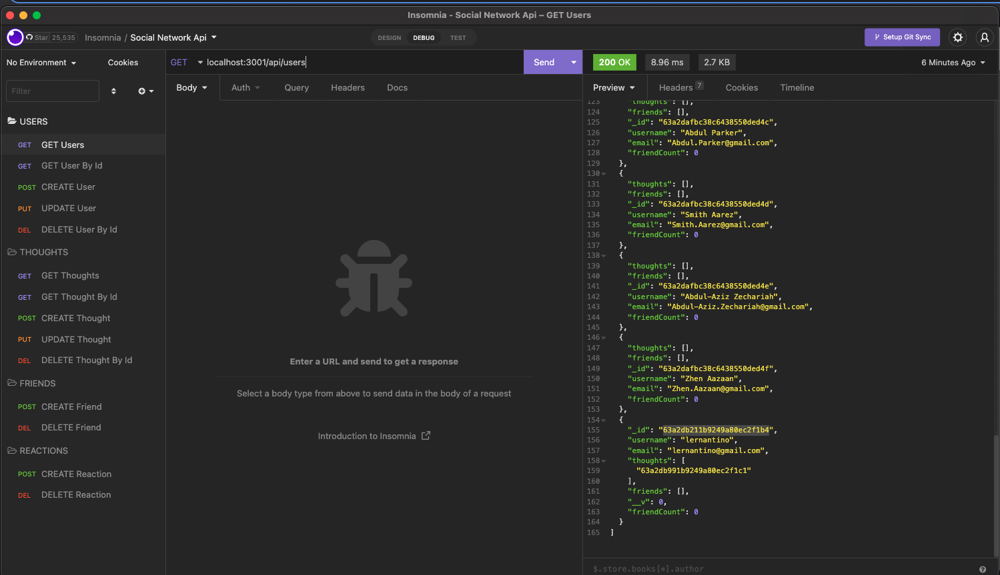
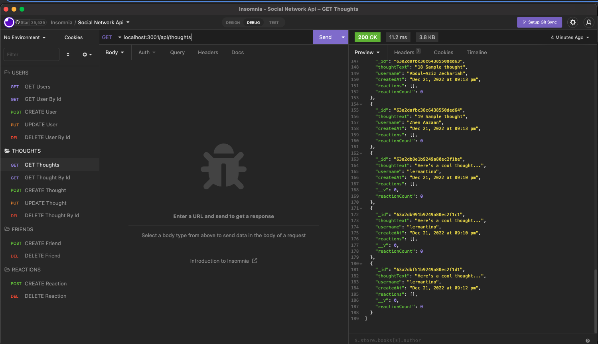
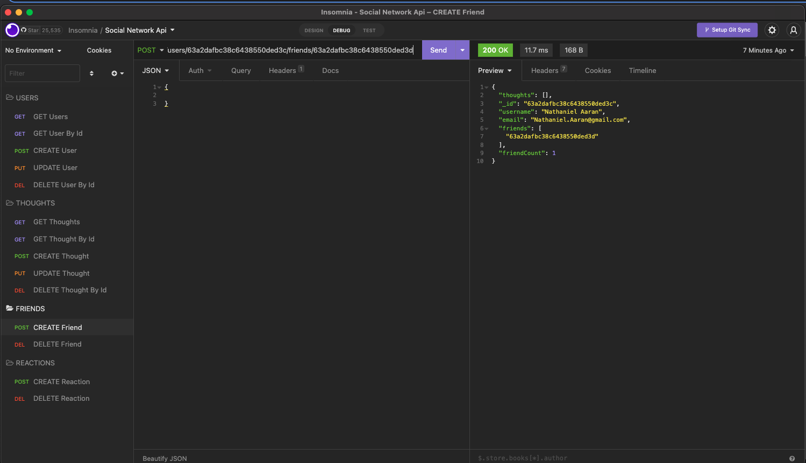
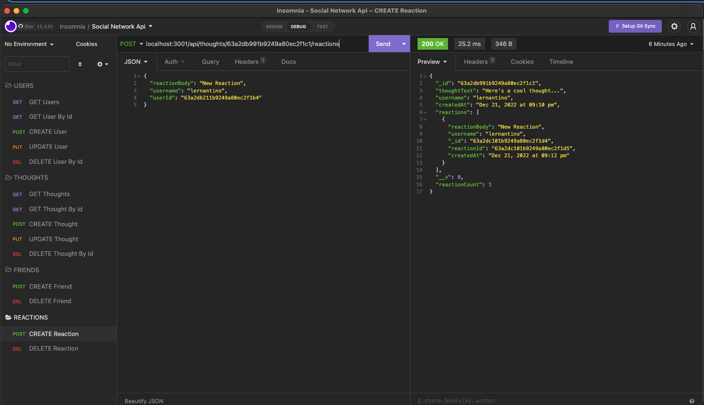

# Social Network API

## Description
Create social network
## Installation
npm run seed
npm start
## Usage
Create a Team web site
## License
Apache
## Badges

## Contributing
Gulcin Dedeoglu

## Questions
https://github.com/gulchintory

# Github Repo Link
https://github.com/gulchintory/social-network-api
# Screenshot

# Video Link
https://drive.google.com/file/d/19_N7Zmvi_Up-B_8XwqNSRMziv869BrMP/view